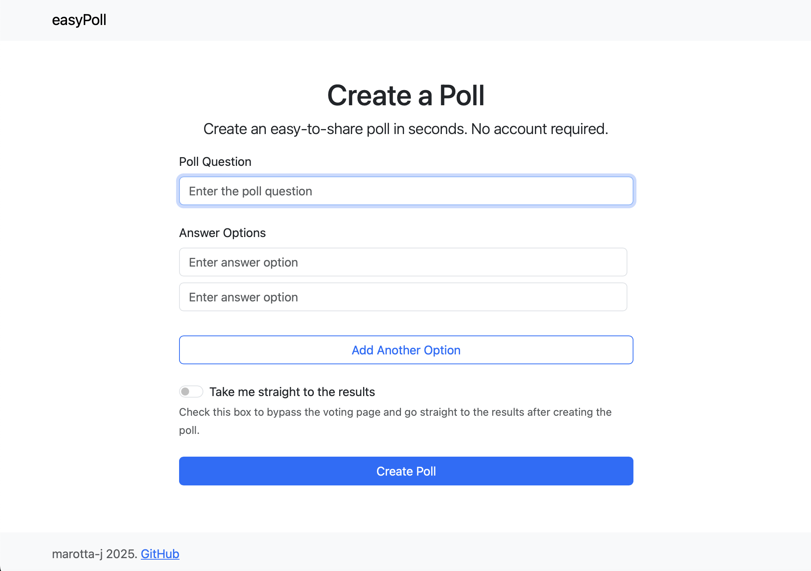
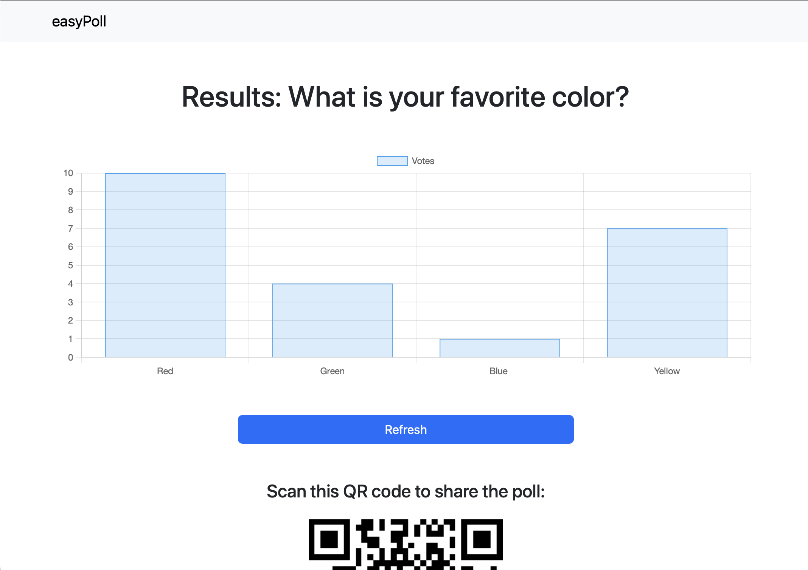

# easyPoll


## [**Try it here!**](https://easypoll.xyz) 🚀

**easyPoll** is a simple web application that allows users to create, share, and vote in polls! 

easyPoll was built with **Django** and **Python**, and is hosted on **Railway**!

---

## Features

- **Create Polls**: Easily create polls with multiple options.
- **Easily Sharable**: QR codes and simple URLs make it easy to share your poll.
- **Real-time Results**: View real-time results after voting!
- **Responsive UI**: Modern UI made with Bootstrap 5


## Screenshots





## Host it yourself
1. **Install dependencies:** ```pip install -r requirements.txt```
2. **Set up environment variables and database in the same directory as ```settings.py```:**
```
SECRET=
ALLOWED_HOST=
ALLOWED_HOST2=
PG_USER=
PG_PASS=
PG_HOST=
PG_PORT=
```
(you may have to change database name in ```settings.py```)

3. **Enjoy!**
